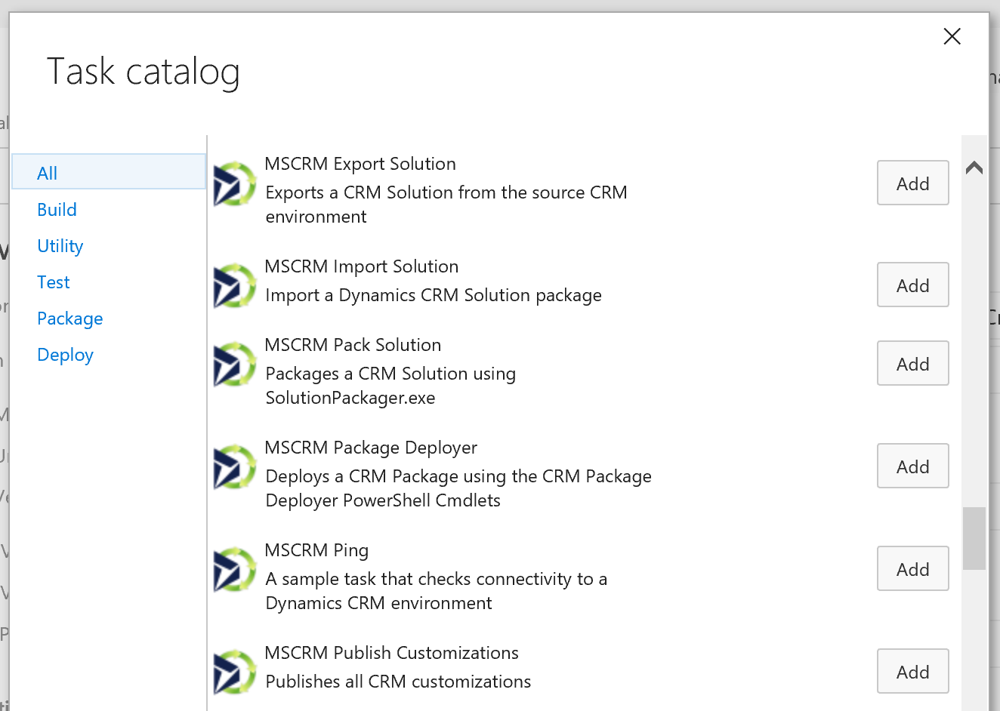

# xRM CI Framework
**The xRM Continuous Integration (CI) Framework is a set of tools that makes it easy and quick to automate builds and deployment of your CRM components.**

This will allow you to setup a fully automated DevOps pipeline so you can deliver CRM more frequently in a consistent and reliable way.

## Task Catalog

Below is a list of tasks that is included with the xRM CI Framework

## Build Automation

You can combine the xRM CI Framework tasks with other tasks to create a build definition as needed.

Below is a sample build definition that publishes customizations, updates solution version to match build number, exports the solution from CRM and then publishes the zip as an artifact in VSTS

## Release Automation

You can combine the xRM CI Framework tasks with other tasks to create a release definition as needed.

Below is a sample release definition that imports the solution generated from the latest build into the QA environment.

## More Information

For more documentation and source code, check out Github using the links on this page
